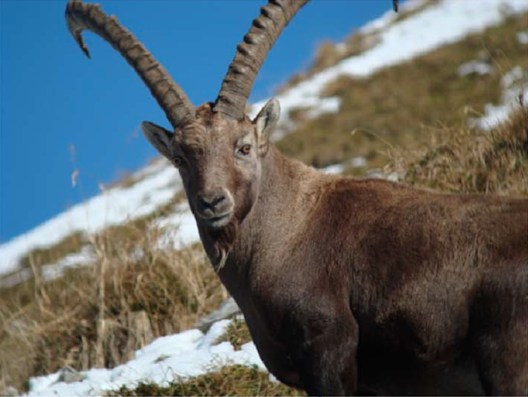
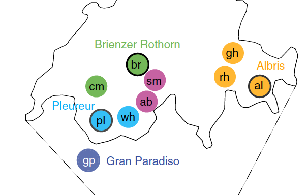

### TP Génétique évolutive 5

(5 décembre 2018)


# Analyses des goulots d'étranglements subis par les bouquetins



### Buts de ces travaux pratiques

- Analyser la structure des populations des bouquetins (Capra ibex)
- Comprendre l'impact des goulots d'étranglement sur la diversité et différenciation des populations
   
### Concepts importants

Référez-vous aux slides du cours "Génétique évolutive" si besoin.

- Techniques de séquençage, SNP, MAF (minor allele frequency)
- Principal component analyses (PCA), F<sub>ST</sub>
- Goulots d'étranglement

### Les données: Grossen et al. 2018

- Les données pour ces travaux pratiques ont été générées dans le cadre d'une étude scientifique: [Grossen et al. 2018](./images/Grossen_et_al-2018-Evolutionary_Applications.pdf)
- Le génotypage s'est fait à l'aide de la technique [RAD-seq](https://en.wikipedia.org/wiki/Restriction_site_associated_DNA_markers) qui permet le génotypage à coût raisonnable d'un grand nombre d'individus
- Les données à disposition comprennent: 135 individus et 1361 SNPs à travers le génome



Les populations suivantes sont incluses: gp, Gran Paradiso; al, Albris; br, Brienzer Rothorn; pl, Pleureur; ab, Aletsch Bietschhorn; sm, Schwarz Mönch; cm, Cape au Moine; gh, Graue Hörner; rh, Rheinwald; wh, Weisshorn. Les populations avec cercle noir sont les lieux d'introductions primaires en Suisse. Voir [Grossen et al. 2018](./images/Grossen_et_al-2018-Evolutionary_Applications.pdf) pour plus de détails.

Q1: Est-ce que les bouquetins ibériques ont aussi souffert une quasi-extinction selon l'étude?

## La structuration des populations réintroduites de bouquetins

Nous allons suivre une procédure très similaire qu'aux TP4. Référez-vous au code des TP4 si les explications ci-dessous vous paraissent incomplètes ou s'il vous faut plus d'explications.

```
# à ajuster!
setwd("~/Dropbox/Daniel/Documents/UNINE/Teaching/**2018_A/TP_GenetiqueEvol_2018/Datasets_in_use/")

### installer les packages nécessaires
# si l'installation de packages échoue, ouvrez le programme R (pas RStudio) et procédéz avec l'installation des packages. Puis, retournez en RStudio.
# install.packages(c("vcfR", "ggplot2", "adegenet", "hierfstat", "gplots", "RColorBrewer", "plyr", "reshape2"))
library(vcfR)
library(adegenet)
library(ggplot2)
library(hierfstat)
library(gplots)
library(plyr)
library(reshape2)
library(RColorBrewer)

# lire le fichier VCF & conversion en format genind et genlight
vcf <- read.vcfR("Alpine_Ibex_1361SNPs_RADseq.vcf")
allchr.snps.genind <- vcfR2genind(vcf)
allchr.snps <- vcfR2genlight(vcf)

# en utilisant ces pièces d'information, créer un dataframe
allchr.df <- data.frame(position = allchr.snps@position, chromosome = allchr.snps@chromosome, SNPid = allchr.snps@loc.names)
# générer l'ordre correct des chromosomes
allchr.df$chromosome <- factor(allchr.df$chromosome, levels = c(paste0("chr", seq(1:29)))) 

# lire le fichier résumant l'information sur les populations
info.df <- read.table("AlpineIbex.info.txt", header=T, sep="\t")

# voir les catégories
head(info.df)

# assignez les individus aux populations ("Population")
pop(allchr.snps) <- info.df$Population[match(indNames(allchr.snps.genind), info.df$Individual)]
pop(allchr.snps.genind) <- info.df$Population[match(indNames(allchr.snps.genind), info.df$Individual)]

# notez que vous pouvez aussi assigner les individus
# selon la colonne "Reintroduction_History") ou selon la colonne "Reintroduction_Genealogy"
```

Q2: Quelle est la significance des colonnes "Reintroduction_History" et "Reintroduction_History" dans le data.frame info.df?

Q3: Générez une PCA de l'ensemble du jeu de données. Utilisez d'abord la catégorie "Population" pour colorer les individus, puis faites une deuxième PCA avec la coloration en fonction de la "Reintroduction_History" et "Reintroduction_Genealogy".

[NB: Vous pouvez utiliser un code quasiment identique au code fourni pour l'homme]

Q4: Expliquez la séparation des populations sur la PCA et surtout la position de la population Gran Paradiso.

Q5: Expliquez le pattern observé sur la PCA colorée en fonction de l'histoire de la population (source, introductions primaires et secondaires - "Reintroduction_History").

Q6: Expliquez le pattern observé sur la PCA colorée en fonction de la généalogie (séquences des réintroductions - "Reintroduction_Genealogy"). Quelle est l'origine des populations dites "admixture"?


### Analyses de la différenciation entre populations par F<sub>ST</sub>

```
# Estimez les Fst par paires de populations et créez l'objet "fst" (étape lente! 1-3 minutes)

# Définissez l'ordre souhaité des populations pour la visualisation
pop.order <- c("Gran Paradiso", "Pleureur", "Weisshorn", "Brienzer Rothorn", "Cape Moine", "Albris", "Graue Hoerner", "Rheinwaldhorn", "Aletsch Bietschhorn", "Schwarz Moench")
fst <- fst[pop.order, pop.order]

# Visualisez les Fst et sauver le graphique
```

Q7: Faites l'analyse et la visualisation des F<sub>ST</sub> par paires. Interprétez pourquoi la population du Weisshorn forme à la fois la paire la plus proche avec la population du Pleureur et la paire la plus distante avec la population du Rheinwaldhorn.

## Evolution de l'hétérozygotie au cours des réintroductions

Q8: Quelle est l'impact d'un goulot d'étranglement sur le niveau de l'hétérozygotie?

```
# accès aux données génotypiques se fait en transformant l'object allchr.snps
allchr.geno.df <- as.data.frame(allchr.snps)

# identification des hétérozygotes (identifiés toujours par "1")
allchr.het <- allchr.geno.df == 1

heterozygosity.perSNP.perPOP <- aggregate(allchr.het, as.data.frame(allchr.snps$pop), function(x) {sum(x, na.rm = T) / length(x)})
heterozygosity.df <- data.frame(Population = heterozygosity.perSNP.perPOP[,1], MeanHeterozygosity = rowMeans(heterozygosity.perSNP.perPOP[,-1]))

# rajouter l'information sur l'histoire de la population
pop.info.df <- info.df[!duplicated(info.df$Population),]
heterozygosity.history.df <- merge(heterozygosity.df, pop.info.df)

ggplot(heterozygosity.history.df, aes(x = reorder(Population, -MeanHeterozygosity), y = MeanHeterozygosity, fill = Reintroduction_History)) +
  geom_bar(stat = "identity") +
  coord_cartesian(ylim = c(0.10, 0.25)) +
  labs(x = "Population", y = "Hétérozygotie moyenne") +
  theme(axis.text = element_text(colour = "black"), axis.text.x = element_text(angle = 45, hjust = 1))

ggsave("Population_heterozygosity.pdf", width = 6, height = 4)
```

Q9: Visualisez l'évolution de l'hétérozygotie au cours des réintroductions à l'aide du code ci-dessus. Est-ce que les changements correspondent à vos attentes? Explications possibles des résultats inattendus?

## L'effet des goulots d'étranglement sur le F<sub>IS</sub>

Q10: Donnez la définition du F<sub>IS</sub> et son interprétation.

Ci-dessous, nous allons utiliser le package `hierfstat` pour calculer une série de paramètres de génétique de populations (y inclut le F<sub>IS</sub>).

```
# Calculs d'un grand nombre de statistiques par population et locus (y inclut les Fst).
pop.stats <- basic.stats(allchr.snps.genind)

### Inspectez les composantes de pop.stats
str(pop.stats)

# Les fréquences alléliques à un locus spécifique
pop.stats$pop.freq$chr10_63263

# Statistiques par locus
head(pop.stats$perloc)

### Statistiques par population
# hétérozygotie attendue
head(pop.stats$Hs)
# hétérozygotie observée
head(pop.stats$Ho)
# coefficient de consanguinité
head(pop.stats$Fis)
```

Q11: Quelles sont les statistiques incluses dans l'objet `pop.stats`?

Générez un résumé des données dans un seul data.frame et visualisez les F<sub>IS</sub>

```
# création d'un data.frame résumant Fis et Hs, puis l'information sur les populations et leur histoire
pop.stats.df <- data.frame(Fis = colMeans(pop.stats$Fis, na.rm = T), Hs = colMeans(pop.stats$Hs, na.rm = T), Population = names(colMeans(pop.stats$Fis, na.rm = T)))
head(pop.stats.df)

# création d'une colonne résumant les régions
pop.stats.df$Reintroduction_History <- info.df$Reintroduction_History[match(pop.stats.df$Population, info.df$Population)]
head(pop.stats.df)

# Visualisation du Fis à travers les populations
ggplot(pop.stats.df, aes(y = Fis, x = reorder(Population, Fis), fill = Reintroduction_History)) + 
  geom_bar(stat = "identity") + labs(x = "Populations") +
  theme(axis.text.x = element_text(angle = 45, hjust = 1))

ggsave("Fis_populations.pdf", width = 6, height = 4)
```

Q12: Avec vos connaissances acquises sur les populations de bouquetins, expliquez la distribution des valeurs F<sub>IS</sub> à travers les populations.

## Impact des goulots d'étranglement sur les fréquences alléliques

Q13: Faites une prédiction (verbale) comment les fréquences alléliques se comportent à travers une série de goulots d'étranglement

Visualisation des fréquences alléliques à un locus aléatoire

```
# Locus aléatoire chr4_21289899 (chromosome 4, position 21'289'899 bp)
pop.stats$pop.freq$chr4_21289899

# création d'un data.frame avec les fréquence REF et ALT
SNP.freq.table <- as.data.frame(pop.stats$pop.freq$chr4_21289899)
names(SNP.freq.table) <- c("allele", "population", "frequency")

SNP.freq.recast <- dcast(SNP.freq.table, population ~ allele)
names(SNP.freq.recast)[2:3] <- c("REF", "ALT")

# Aperçu du tableau
SNP.freq.recast

# Définir un ordre regroupant les populations primaires et secondaires
pop.order <- c("Gran Paradiso", "Pleureur", "Weisshorn", "Brienzer Rothorn", "Cape Moine", "Albris", "Graue Hoerner", "Rheinwaldhorn", "Aletsch Bietschhorn", "Schwarz Moench")
SNP.freq.recast$population <- factor(SNP.freq.recast$population, levels = pop.order)

ggplot(SNP.freq.recast, aes(x = population, y = REF)) + 
  geom_bar(stat = "identity") +
  labs(x = "Population", y = "Reference allele frequency") + 
  ggtitle("chr4_21289899") +
  theme(axis.text = element_text(colour = "black"), axis.text.x = element_text(angle = 45, hjust = 1))

ggsave("FST-chr4_21289899.pdf", width = 5, height = 3.5)
```

Q14: Est-ce que les fréquences au locus aléatoirement choisi correspondent à vos prédictions?

Une analyse plus complète est bien nécessaire. Voilà une option de code pour visualiser les fréquences alléliques à 10 loci choisi aléatoirement

```
# Création d'un data.frame contenant l'ensemble des fréquences alléliques

# matrice contenant des fréquences pour REF et ALT à chaque locus
full.freq.matrix <- do.call(rbind, pop.stats$pop.freq)

# sélection des fréquences REF uniquement, élimination des rownames car toujours 0
REF.freq.matrix <- full.freq.matrix[row.names(full.freq.matrix) == 0,]
row.names(REF.freq.matrix) <- NULL
REF.freq.df <- as.data.frame(REF.freq.matrix)

REF.freq.df$locus <- names(pop.stats$pop.freq)

REF.freq.m.df <- melt(REF.freq.df, id.vars = "locus", variable.name = "Population", value.name = "Allele.freq")

pop.info.df <- info.df[!duplicated(info.df$Population),]

REF.freq.history.df <- merge(REF.freq.m.df, pop.info.df, all.x = T)

pop.order <- c("Gran Paradiso", "Pleureur", "Weisshorn", "Brienzer Rothorn", "Cape Moine", "Albris", "Graue Hoerner", "Rheinwaldhorn", "Aletsch Bietschhorn", "Schwarz Moench")
REF.freq.history.df$Population <- factor(REF.freq.history.df$Population, levels = pop.order)

# randomly select 10 loci
ten.random.loci <- sample(unique(REF.freq.history.df$locus), 10)

ggplot(REF.freq.history.df[REF.freq.history.df$locus %in% ten.random.loci,], aes(x = Population, y = Allele.freq, group = locus, color = locus)) + 
  geom_line(size = 1.5) + labs(y = "Allele frequency") +
  geom_point(aes(y = -0.05, x = Population, shape = Reintroduction_Genealogy), color = "black", size = 3) +
  theme(axis.text = element_text(colour = "black"), axis.text.x = element_text(angle = 45, hjust = 1))

ggsave("Allele_Freq.Ten_random_loci.pdf", width = 7, height = 4.5)
```

Q15: Essayez une série de loci aléatoirement choisis (relancer la sélection de 10 loci ci-dessus). Sélectionnez un graphique qui vous paraît explicative et puis interprétez l'évolution des fréquences alléliques en fonction de l'histoire évolutive des  populations (introduction primaire, secondaire, admixture, etc.)

Q16: Après avoir fait toutes ces analyses: Est-ce qu'il vous semble que les bouquetins sont en danger? Et puis, si vous étiez en charge de planifier des translocations d'invidus, vous les feriez entre quelles populations? Argumentez en s'appuyant sur les résultats que vous avez obtenus.